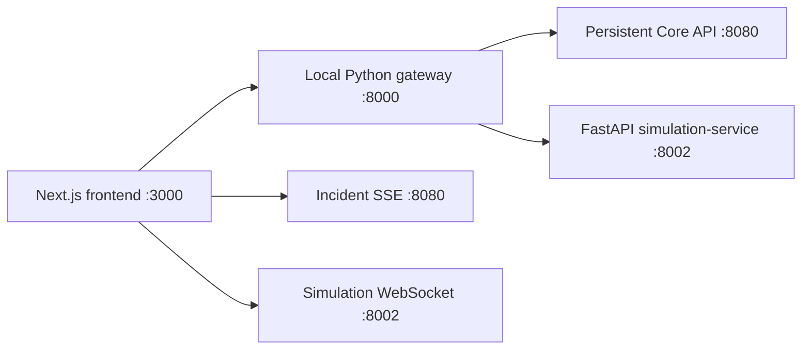
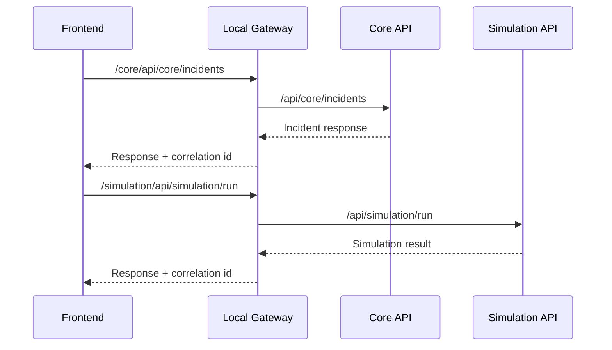

# UrbanShield Architecture

UrbanShield currently prioritizes a reliable no-Docker local workflow. The default stack is:

## Request Flow

## Phase 4 Foundation

Implemented:

- Hardened local gateway with correlation IDs, rate limits, request-size limits, upstream timeouts, CORS, security headers, service health, and Prometheus-style metrics.
- Production frontend security headers.
- `start.py` Phase 4 command surface for local mode, health reports, and validation.
- SQLite-backed local core API with incidents, history, emergency vehicles, dispatches, environmental readings, audit records, and event outbox records.
- Working `start.py --migrate`, `--seed`, and `--reset-db` for local core persistence.

## Deployment Modes

- `local`: the default, no-Docker workflow.
- `docker`: optional Docker Compose workflow retained from the previous codebase.

PostgreSQL/PostGIS mode, authentication, scenario persistence, ML service, Redis event broker, and observability stack are planned Phase 4 components and are not yet implemented.
